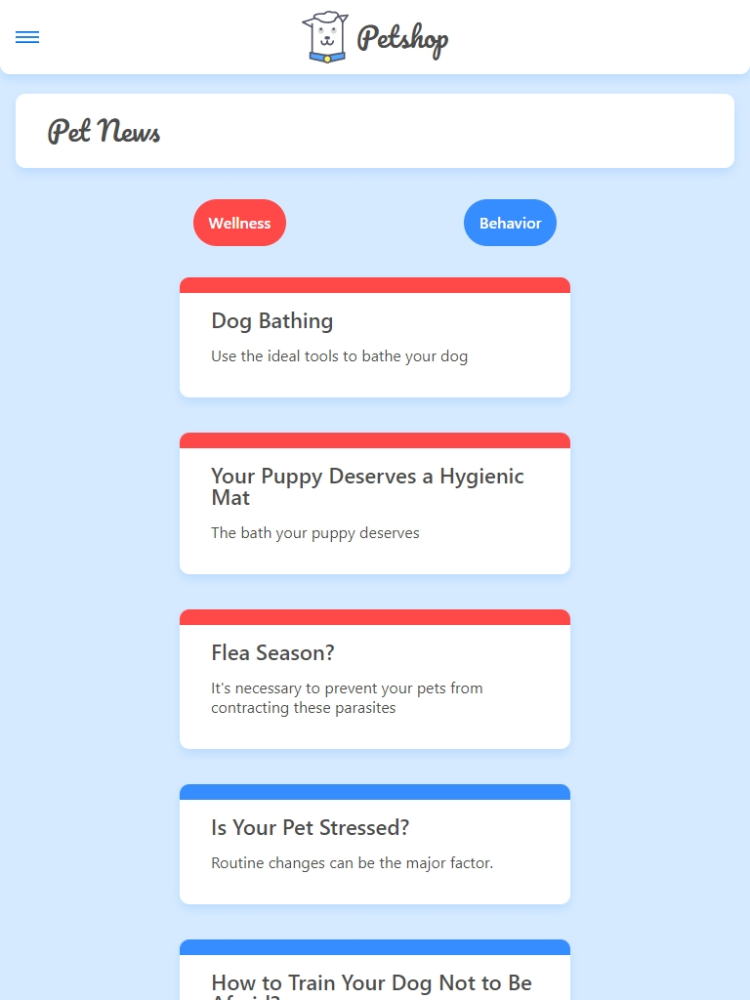

 
  <h1>Petshop News Blog React Router SPA</h1>

 
   
  
  
  
  
  
  
  

## Description

This project is a Pet News Blog developed as part of the React course at Alura Latam. The app features a variety of pet-related news articles and includes navigation for different categories and subcategories of news.

## Key Features

- **View Categories**: Browse posts by categories.
- **View Subcategories**: Browse posts within subcategories.
- **404 Page**: Custom 404 page for non-existent routes.

## Screenshots

  
    
   
     
   

## Additional Information

- This project was part of the React course on Alura Latam.
- Developed by Evelin Alvarado.
- Find me on [GitHub](https://github.com/EvelinAlvarado) and [LinkedIn](https://www.linkedin.com/in/evelinalvarado/).

Check out the live project: [Pet News Blog](https://petshop-project-react-router-spa.vercel.app/)

### Dependencies

- `axios`: Used for making HTTP requests to fetch data from the server.
- `react-router-dom`: Utilized for client-side routing to navigate between different pages.
- `json-server`: Used to create a mock REST API for fetching posts and categories.

## Objective

This project aims to improve skills in React, including the use of `useState` and `useEffect` hooks, as well as React Router for navigation.
